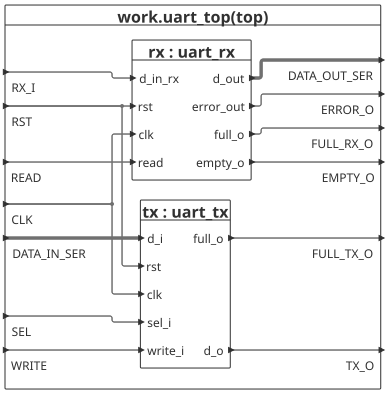
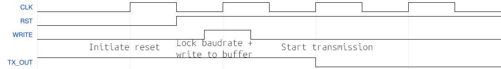
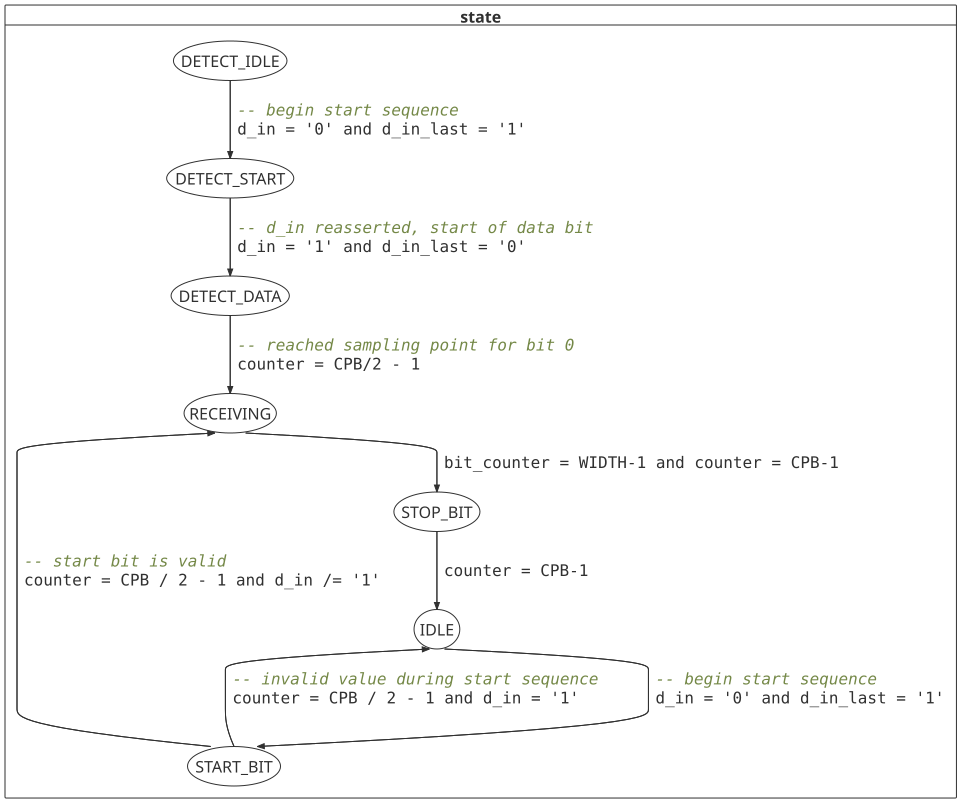

## OVERVIEW
This UART module is able to transmit at 9600baud (slow mode) and 115200baud (fast mode).
Reception is possible at baudrates from 4800baud and was tested up to 1Mbaud on the Tang Nano 9K board.
The implementation consists of two subsystems, namely TX and RX.

### GENERICS
| Name | Type | Description |
| --- | --- | --- |
| CLK_FREQ | integer | Clock frequency |
| WIDTH | integer | Number of bits per transmission | 
| DEPTH | integer | Number of slots of the FIFO buffer |

### PORTS
| Name | Direction | Type|
| --- | --- | --- |
|RX_I|in|std_logic|
|DATA_IN_SER|in|std_logic_vector(WIDTH-1 downto 0)|
|CLK|in|std_logic|
|RST|in|std_logic|
|SEL|in|std_logic|
|READ|in|std_logic|
|WRITE|in|std_logic|
|ERROR_O|out|std_logic|
|DATA_OUT_SER|out|std_logic_vector(WIDTH-1 downto 0)|
|TX_O|out|std_logic|
|FULL_RX_O|out|std_logic|
|FULL_TX_O|out|std_logic|
|EMPTY_RX_O|out|std_logic|

Both subsystems are implemented as FSMDs (Finite State Machines with Datapath) largely using a two process design. Additionally they consist of a FIFO buffer to enable multiple bytes to be written/received between outside interventions.

## APPLICATION NOTES
On startup, the reset port must be asserted low for at least one rising edge of the clock. The module subsequently requires one more clock cycle to revert to the idle state, such that transmission and reception can start on the next rising edge.

### TX subsytem
 

Selection between the two modes is possible using the sel port.
Input on  SEL must be stable at least one rising edge before beginning transmission.
The data to be transmitted is passed to the TX-subsystem via the DATA_IN_SER input and is first stored in the buffer. Transmission starts as soon as as soon as the buffer is not empty (e.g. on the second rising edge after reset). Further bytes can be written into the buffer by asserting WRITE high provided the FULL output is not asserted.  Transmission continues until the buffer is emptied.

### RX subsytem

The data received is written to a buffer by the RX-subsystem when the stop bit has been read. The D_OUT_SER value is set to 0x00 upon reset. If there has been an error during the reading process, ERROR_O will be toggled for one clock cycle, and the RX-subsystem will return to IDLE state. The output will not be written into the buffer.
A byte can be read from the buffer by asserting READ high. 
The FULL_RX_O output indicates whether the FIFO buffer is full. Should that be the case, subsequent transitions will be received by the subsystem, but they won't be written into the buffer. Therefore, data is lost.
The RX-subsystem uses automatic baud rate detection (autobaud) to determine the baudrate of incoming transmissions.
Thus, after a reset, a defined sequence must be followed, as outlined below.

#### AUTOBAUD OPERATION
After a reset, the RX-subsytem transitions into the state "DETECT_IDLE".

In this state, the subsystem will wait for the beginning of a transmission of the ASCII character 'U' in order to determine the baud rate. This baud rate will be utilized until the next reset is started. Thus, a reset and another handshake is necessary to change the baudrate of the receiver. The RX- and TX-subsystem's baud rates are indipendent and do not influence each other.

## SYNCHRONIZATION AND FILTERING

The RX_I input of the RX-subsystem is used after being routed through a two stage synchronizer and a filter. Filtering is accomplished by using a counter to keep track of the value of the current bit relative to the previous values. The counter is incremented in case of a '1' and decremented in case of a '0'. The maximum value is 3 and a minimum value of 0. Thus, to change a stable value, the opposite must be applied for at least 3 clock cycles in order to toggle the signal. The influence of noise is therefore minimized, preventing false starts or errors.

## HARDWARE IMPLEMENTATION

The module was tested on the Tang Nano 9K using an external seven-segment display. Thus, the received data can be evaluated. The toolchain used is yosys -> nextpnr -> gowin_pack -> openFPGALoader. The top level entity assume the seven segment display is of the common cathode type. The interal (27MHz) clock is utilized.