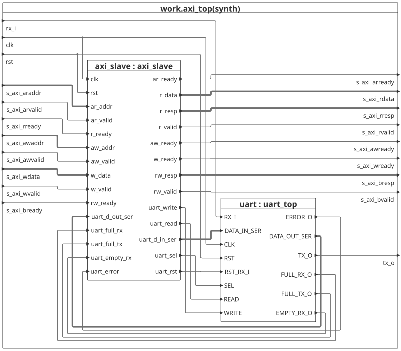

# UART Module
This UART module is able to transmit at baudrates between 9600baud and 921600baud.
Reception is possible at baudrates from 4800baud and was tested up to 1Mbaud on the Tang Nano 9K board.
The implementation consists of two subsystems, namely the UART subsystem and an AXI4-Lite wrapper.
The UART subsystem itself contains an RX- and TX-subsystem each.
The module can be connected to a CPU using the AXI4-Lite bus.

# TOP LEVEL OVERVIEW

## GENERICS AND PORTS

### GENERICS
| Name     | Type    | Description                        |
| -------- | ------- | ---------------------------------- |
| CLK_FREQ | integer | Clock frequency                    |
| WIDTH    | integer | Number of bits per transmission    |
| DEPTH    | integer | Number of slots of the FIFO buffer |

### PORTS
| Name | Direction | Type      |
| ---- | --------- | --------- |
| RX_I | in        | std_logic |
| CLK  | in        | std_logic |
| RST  | in        | std_logic |
| TX_O | out       | std_logic |

+AXI4-Lite ports, each with prefix "s_axi"
## BLOCK DIAGRAM

## REGISTER MAP

| Address | Name    | Type |
| ------- | ------- | ---- |
| 0x00    | RX_OUT  | R    |
| 0x04    | TX_IN   | W    |
| 0x08    | CONTROL | W    |
| 0x0C    | STATUS  | R    |

### RX_OUT (0x00) 
Read only register. Contains the most recently retreived value from the RX subsystem's buffer.
| Bits          | Type | Description    |
| ------------- | ---- | -------------- |
| 31 : WIDTH    | RSVD | No Access      |
| WIDTH - 1 : 0 | R    | Retreived byte |

### TX_IN (0x04) 
Write only register. Contains the next value to be written into the RX subsystem's buffer.
| Bits          | Type | Description   |
| ------------- | ---- | ------------- |
| 31 : WIDTH    | RSVD | No Access     |
| WIDTH - 1 : 0 | W    | Byte to write |

### CONTROL (0x08) 
Write only register. Contains the next configuration to be used.
| Bits   | Type | Description |
| ------ | ---- | ----------- |
| 31 : 4 | RSVD | No Access   |
| 4  : 1 | W    | SEL         |
| 0      | W    | RST_RX      |

_Note: The reset bit is applied only one clock cycle. Thus, it does not need to be reasserted manually._

#### SEL input meaning:
| SEL Value | Baudrate |
| --------- | -------- |
| 000       | 9600     |
| 001       | 19200    |
| 010       | 38400    |
| 011       | 57600    |
| 100       | 115200   |
| 101       | 230400   |
| 110       | 460800   |
| 111       | 921600   |

### STATUS (0x0C) 
Read only register. Contains status of the UART subsystem.
| Bits   | Type | Description |
| ------ | ---- | ----------- |
| 31 : 4 | RSVD | No Access   |
| 3      | R    | FULL_RX     |
| 2      | R    | FULL_TX     |
| 1      | R    | EMPTY_RX    |
| 0      | R    | ERROR       |
## OPERATION

### START-UP AND INITIAL OPERATION
Upon start-up, the RST input must be deasserted (active low) for at least one rising edge of CLK. The module requires one more rising edge to be ready for reception/transmission. 

### RECEIVING DATA
As the RX Subsystem uses an autobaud system, a handshake byte must be sent to determine the baudrate. This module uses the byte 'U'/0x55. Should a different baudrate be desired, the RX subsytem must be reset. This can be done in two ways:
1. Global reset by deasserting RST
2. RX reset by asserting the RST_RX bit of the CONTROL register

The minimum baudrate is 4800, the maximum tested is 1M. Received data is placed into the FIFO buffer. Each read cycle retreives one byte. Should the FIFO be empty, a read response of "10" (SLVERR) is returned. In case of a read request from a write only register, a read response of "11" (DECERR) is returned.

### TRANSMITTING DATA
The TX system supports eight transmission modes. The baudrates range from 9600 to 921600. Selection can be done by setting the value of the SEL bits of the CONTROL register. Should a write be initiated while the FIFO is full, a response of "10" (SLVERR) is returned. In case of a write request to a read only register, a write response of "11" (DECERR) is returned. 

# UART Subsystem
## GENERICS AND PORTS
### GENERICS
| Name     | Type    | Description                        |
| -------- | ------- | ---------------------------------- |
| CLK_FREQ | integer | Clock frequency                    |
| WIDTH    | integer | Number of bits per transmission    |
| DEPTH    | integer | Number of slots of the FIFO buffer |

### PORTS
| Name         | Direction | Type                               |
| ------------ | --------- | ---------------------------------- |
| RX_I         | in        | std_logic                          |
| DATA_IN_SER  | in        | std_logic_vector(WIDTH-1 downto 0) |
| CLK          | in        | std_logic                          |
| RST          | in        | std_logic                          |
| SEL          | in        | std_logic_vector(2 downto 0)                          |
| READ         | in        | std_logic                          |
| WRITE        | in        | std_logic                          |
| ERROR_O      | out       | std_logic                          |
| DATA_OUT_SER | out       | std_logic_vector(WIDTH-1 downto 0) |
| TX_O         | out       | std_logic                          |
| FULL_RX_O    | out       | std_logic                          |
| FULL_TX_O    | out       | std_logic                          |
| EMPTY_RX_O   | out       | std_logic                          |

_UART Subsystem block diagram_

Both subsystems are implemented as FSMDs (Finite State Machines with Datapath) largely using a two process design. Additionally they consist of a FIFO buffer to enable multiple bytes to be written/received between outside interventions.

## APPLICATION NOTES
On startup, the reset port must be asserted low for at least one rising edge of the clock. The module subsequently requires one more clock cycle to revert to the idle state, such that transmission and reception can start on the next rising edge.
All further interfacing with the module is done via AXI4-Lite. Operation of specific pins as detailed below is done by the AXILite slave.

### TX subsytem
 

Selection between the modes is possible using the sel port.
Input on  SEL must be stable at least one rising edge before beginning transmission.
The data to be transmitted is passed to the TX-subsystem via the DATA_IN_SER input and is first stored in the buffer. Transmission starts as soon as as soon as the buffer is not empty (e.g. on the second rising edge after reset). Further bytes can be written into the buffer by asserting WRITE high provided the FULL output is not asserted.  Transmission continues until the buffer is emptied.

### RX subsytem

The data received is written to a buffer by the RX-subsystem when the stop bit has been read. The D_OUT_SER value is set to 0x00 upon reset. If there has been an error during the reading process, ERROR_O will be toggled for one clock cycle, and the RX-subsystem will return to IDLE state. The output will not be written into the buffer.
A byte can be read from the buffer by asserting READ high. 
The FULL_RX_O output indicates whether the FIFO buffer is full. Should that be the case, subsequent transitions will be received by the subsystem, but they won't be written into the buffer. Therefore, data is lost.
The RX-subsystem uses automatic baud rate detection (autobaud) to determine the baudrate of incoming transmissions.
Thus, after a reset, a defined sequence must be followed, as outlined below.

#### AUTOBAUD OPERATION
After a reset, the RX-subsytem transitions into the state "DETECT_IDLE".

In this state, the subsystem will wait for the beginning of a transmission of the ASCII character 'U' in order to determine the baud rate. This baud rate will be utilized until the next reset is started. Thus, a reset and another handshake is necessary to change the baudrate of the receiver. The RX- and TX-subsystem's baud rates are indipendent and do not influence each other.

### SYNCHRONIZATION AND FILTERING

The RX_I input of the RX-subsystem is used after being routed through a two stage synchronizer and a filter. Filtering is accomplished by using a counter to keep track of the value of the current bit relative to the previous values. The counter is incremented in case of a '1' and decremented in case of a '0'. The maximum value is 3 and a minimum value of 0. Thus, to change a stable value, the opposite must be applied for at least 3 clock cycles in order to toggle the signal. The influence of noise is therefore minimized, preventing false starts or errors.

## HARDWARE IMPLEMENTATION

The module was tested on the Tang Nano 9K using an external seven-segment display. Thus, the received data can be evaluated. The toolchain used is yosys -> nextpnr -> gowin_pack -> openFPGALoader. The top level entity assume the seven segment display is of the common cathode type. The interal (27MHz) clock is utilized.

## AXILite Slave implementation
The AXILite slave used in the module consists of two subsystems. Namely, READ and WRITE. Both are implemented as pipelines. Thus, throughput is improved, and the module can accept both write and read instructions at a rate of 1 instruction every three clock cycles. The write subsystem's pipeline consists of three stages, namely DECODE, LOAD and RESP. The read subsystem's pipeline consists of two stages, DECODE and LOAD.